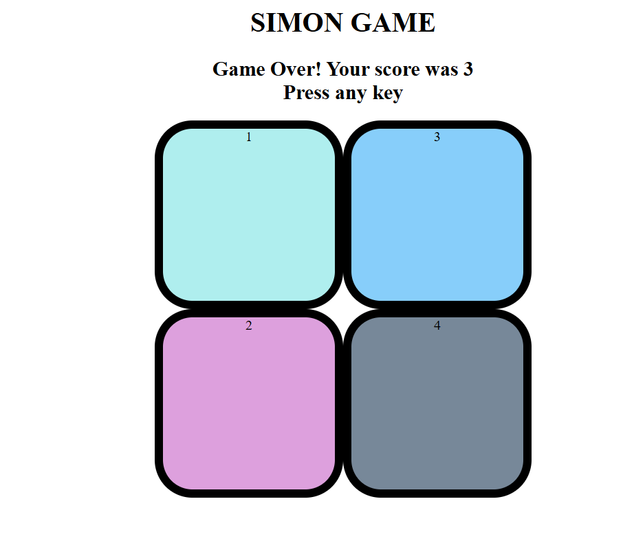

Simon Says
A fun color matching game built using frontend mainly using various functions of JavsScript.
The goal is to remember and repeat the sequence of flashing colors — each round adds a new color to the sequence.  

--Tech Stack--
HTML – Structure of the game
CSS– Styling and animations
JavaScript– Game logic & interactivity

--How to Play--
1. Open the game in your browser.
2. Press any key to start.
3. Watch the color sequence carefully.
4. Click the buttons in the exact same order.
5. Each round, the sequence gets longer.
6. If you click the wrong color — Game Over!

--Screenshot--

